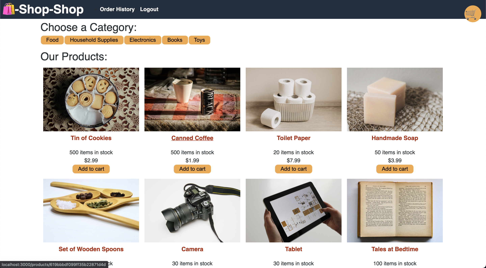

# redux-store

    

## Description

This application is an e-commerce website built with the MERN stack. I was tasked with refactoring this code which used the React-Context-API to use Redux in order to store global state.

## Table of Contents:
* [Installation](#installation)
* [Usage](#usage)
* [Screenshot](#screenshot)
* [Credits](#credits)


## Installation 

This project requires node to be installed on your local machine.

```
git clone git@github.com:ZachYarbrough/redux-store.git
cd redux-store
npm i
```

## Usage

```
npm run start:dev
```

This projects development environment uses concurrently to run both the server and client server at the same time from the root directory, if you find the start:dev command does not work from root, try running both the client and server from separate command line tabs.

## Screenshot

      

## Credits

UT Austin Coding Bootcamp